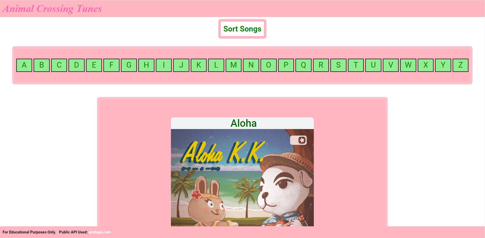

# animalcrossingtunes
 
<h1>Listen to your favorite songs from the famous game Animal Crossing New Horizons.</h2>

Link to project: https://animalcrossingtunes.herokuapp.com/

<h2>How It's Made:</h2>

 
<h3>Tech Used: HTML, CSS, Javascript, API.</h3>

Before building this web application, I worked with the Animal Crossing API to figure out how the API worked and what kind of information I could retrieve from it. Once I learned the structure of the API, I built a program that would extract song information from the API and populate the webpage with songs that users could listen to. Once the logic was up and running, I constructed a user interface on the webpage that would allow users to retrieve and sort songs from the Animal Crossing API. Once the interface was set up, I cleaned up the layout of the webpage to make the webpage more appealing and easier to navigate.

